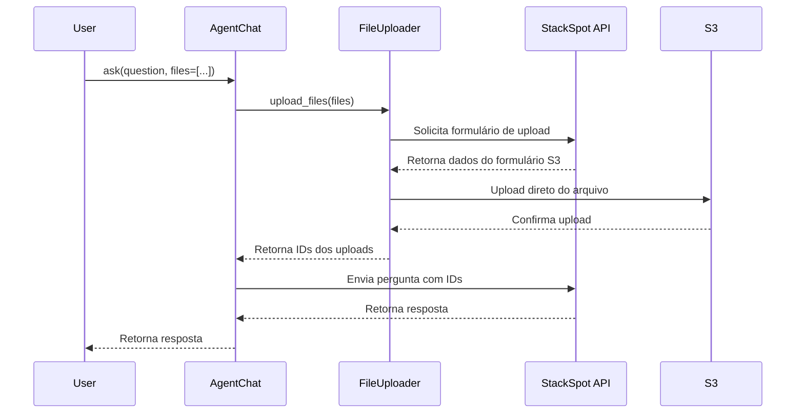
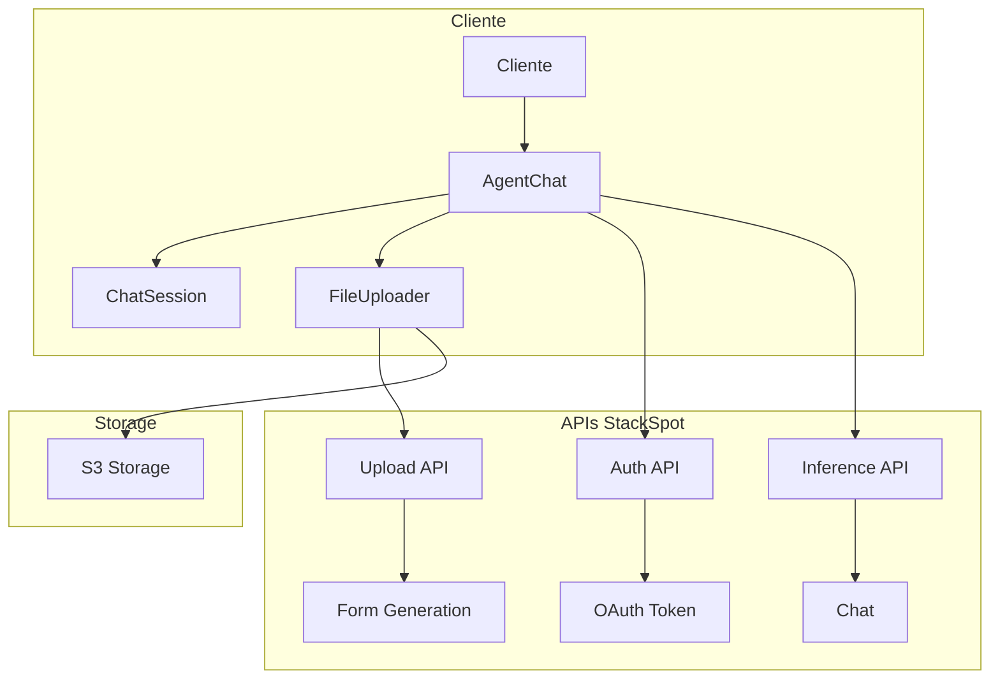
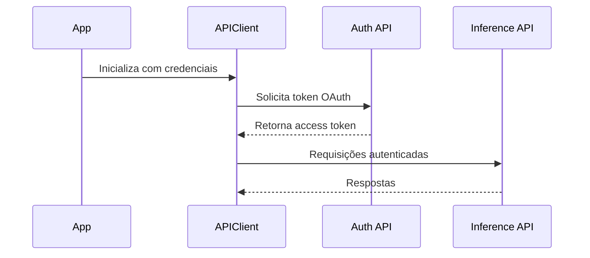
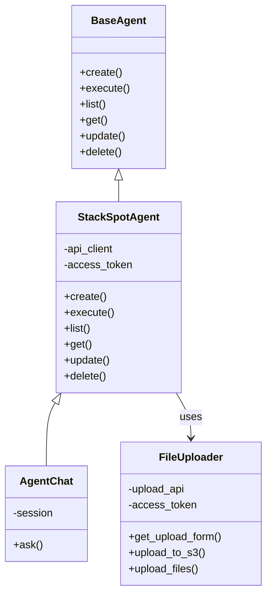

# Diagramas de Arquitetura

## Fluxo de Upload de Arquivos

```mermaid
sequenceDiagram
    participant User
    participant AgentChat
    participant FileUploader
    participant StackSpot API
    participant S3

    User->>AgentChat: ask(question, files=[...])
    AgentChat->>FileUploader: upload_files(files)
    FileUploader->>StackSpot API: Solicita formulário de upload
    StackSpot API-->>FileUploader: Retorna dados do formulário S3
    FileUploader->>S3: Upload direto do arquivo
    S3-->>FileUploader: Confirma upload
    FileUploader-->>AgentChat: Retorna IDs dos uploads
    AgentChat->>StackSpot API: Envia pergunta com IDs
    StackSpot API-->>AgentChat: Retorna resposta
    AgentChat-->>User: Retorna resposta
```

## Arquitetura do Sistema

```mermaid
graph TD
    subgraph Cliente
        A[Cliente] --> B[AgentChat]
        B --> C[ChatSession]
        B --> D[FileUploader]
    end

    subgraph APIs StackSpot
        E[Auth API] --> F[OAuth Token]
        G[Inference API] --> H[Chat]
        I[Upload API] --> J[Form Generation]
    end

    subgraph Storage
        K[S3 Storage]
    end

    B --> E
    B --> G
    D --> I
    D --> K
```

## Fluxo de Autenticação

```mermaid
sequenceDiagram
    participant App
    participant APIClient
    participant Auth API
    participant Inference API

    App->>APIClient: Inicializa com credenciais
    APIClient->>Auth API: Solicita token OAuth
    Auth API-->>APIClient: Retorna access token
    APIClient->>Inference API: Requisições autenticadas
    Inference API-->>APIClient: Respostas
```

## Estrutura de Classes

```mermaid
classDiagram
    BaseAgent <|-- StackSpotAgent
    StackSpotAgent <|-- AgentChat
    
    class BaseAgent {
        +create()
        +execute()
        +list()
        +get()
        +update()
        +delete()
    }
    
    class StackSpotAgent {
        -api_client
        -access_token
        +create()
        +execute()
        +list()
        +get()
        +update()
        +delete()
    }
    
    class AgentChat {
        -session
        +ask()
    }
    
    class FileUploader {
        -upload_api
        -access_token
        +get_upload_form()
        +upload_to_s3()
        +upload_files()
    }

    StackSpotAgent --> FileUploader : uses
```